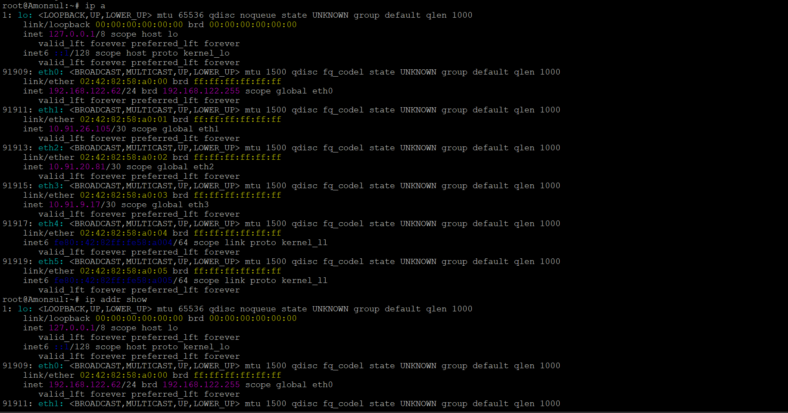
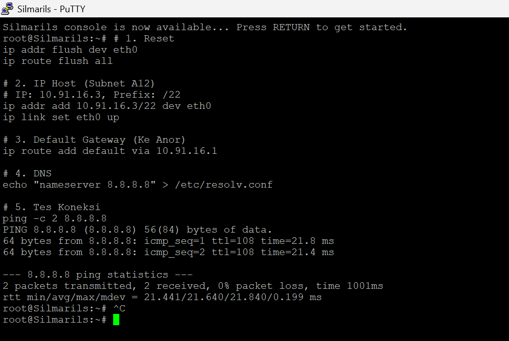
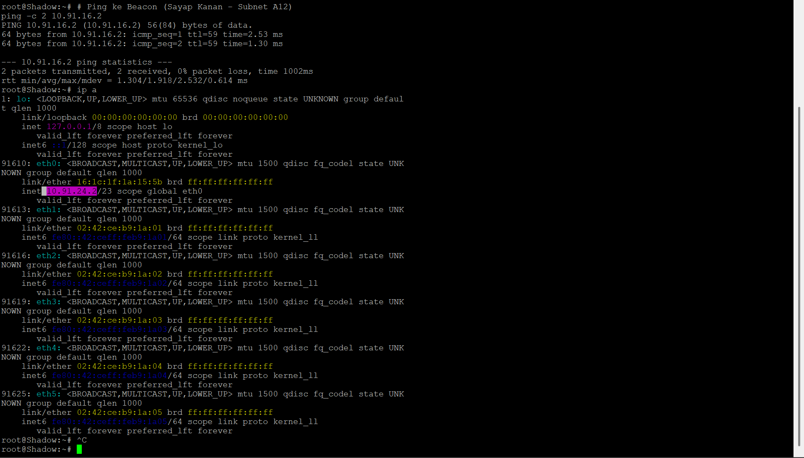
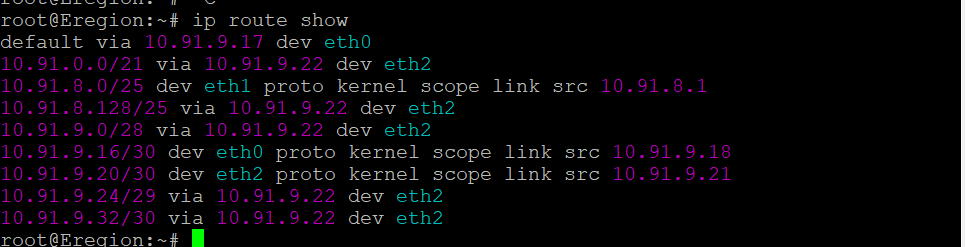

# PRAKTIKUM JARKOM MODUL 3 KELOMPOK 55 - 2025

## Angota Kelompok

| Nama                         | NRP        |
| ---------------------------- | ---------- |
| Ardhi Putra Pradana          | 5027241022 |
| M. Hikari Reiziq Rakhmadinta | 5027241079 |

## Laporan

[LINK SPREADSHEET]
https://docs.google.com/spreadsheets/d/1Ns_DI_YEprcioQDcubR_a5_2euuPRsUyHAMoN4D1RHU/edit?usp=sharing

### CPT - VLSM

1. Berikut topologi yang dibuat untuk cisco packet tracer.

   

   Setelah dilakukan analisa terhadap topologi tersebut, dapat disimpulkan terdapat sebanyak **23 subnet** yang perlu dilakukan.

2. Total penggunaan subnet.

   Total subnet yang digunakan adalah **23 subnet** dimana total IP yang digunakan adalah **3219 IP** dan menghasilkan total ip yang available adalah **4030 IP** dimana artinya pendekatan terbesar adalah mendapatkan subnet **/20**. Untuk ini dapat lihat pada Spreadsheet yang sudah diberikan diatas.

   Dan berikut adalah hasil VLSM Tree yang ada:

   

3. Static routing.

   Pada praktikum ini hanya diharuskan untuk melakukan static routing, dimana dengan hal tersebut harus dilakukan config terhadap tiap router untuk bagaimana bisa mendapatkan rute atau jalur yang diharapkan.

   Cara melakukan routing adalah dengan melihat bagaimana jalur dari satu subnet ke subnet yang lainnya.
   Untuk bagaimana routing dilakukan dapat dilihat pada file berikut ini:

   - [left route](./routings/cpt/left-route.txt)
   - [right route](./routings/cpt/right-route.txt)
   - [bottom route](./routings/cpt/bottom-route.txt)

4. Setting static ip

   Untuk melakukan static ip bisa diset pada tiap tiap router ataupun client, dengan melihat ip range yang sudah ditentukan atau sudah didapatkan pada Spreadsheet.

### GNS3 - CIDR

Berbeda dengan CPT yang menggunakan VLSM, pada topologi GNS3 ini diterapkan metode **CIDR (Classless Inter-Domain Routing)**. Fokus utama metode ini adalah melakukan penggabungan rute (*route summarization*) untuk efisiensi tabel routing.

1. **Topologi GNS3**

   Berikut adalah desain topologi yang dibangun di GNS3. Topologi ini dibagi menjadi 3 wilayah utama (Sayap Kiri, Sayap Kanan, dan Sayap Bawah) yang terhubung ke satu router pusat (Amonsul).

   

2. **Perhitungan Penggabungan IP (Supernetting)**

   Untuk mencapai efisiensi routing, dilakukan penggabungan subnet (*supernetting*) dari subnet-subnet kecil menjadi blok yang lebih besar. Proses ini dilakukan secara bertahap (*bottom-up*) berdasarkan wilayah topologi.

   - **Tahap 1 & 2 (Penggabungan Level Bawah):**
     Menggabungkan subnet-subnet kecil yang berdekatan (contoh: A22+A23, A9+A11) menjadi supernet sementara.
     
     
     

   - **Hasil Akhir Penggabungan (Supernet Utama):**
     Berdasarkan total kebutuhan host per wilayah, didapatkan 3 Blok Supernet Utama yang akan didaftarkan pada router pusat (Amonsul):
     
     * **Sayap Bawah (2318 Host):** Membutuhkan blok **/20**. Dialokasikan `10.91.0.0/20`.
     * **Sayap Kanan (1102 Host):** Membutuhkan blok **/21**. Dialokasikan `10.91.16.0/21`.
     * **Sayap Kiri (610 Host):** Membutuhkan blok **/22**. Dialokasikan `10.91.24.0/22`.

     Visualisasi pembagian wilayah CIDR dapat dilihat pada gambar berikut:
     
     

3. **Perhitungan Pembagian IP (Subnetting)**

   Setelah blok induk dibagi ke masing-masing sayap, dilakukan pembagian IP ke setiap subnet (A1 - A23) secara hierarkis.

   

   #### **Studi Kasus Perhitungan: Subnet A18**
   Berikut adalah contoh detail langkah-langkah mendapatkan Prefix, Network ID, Broadcast, dan Range IP untuk **Subnet A18** (Sayap Bawah):

   **a. Menentukan Prefix (CIDR)**
   * **Kebutuhan Host:** 875 Host.
   * **Rumus:** $2^n - 2 \geq \text{Kebutuhan Host}$.
   * **Pencarian $n$ (Bit Host):**
       * $2^9 = 512$ (Kurang)
       * $2^{10} = 1024$ (Cukup) $\rightarrow$ Maka, $n = 10$.
   * **Prefix CIDR:** $32 - n = 32 - 10 = \mathbf{/22}$.

   **b. Menghitung Block Size (Total IP)**
   * Rumus: $2^{(32 - \text{Prefix})} = 2^{(32-22)} = 2^{10} = \mathbf{1024}$ IP.
   * Karena 1 oktet bernilai 256, maka $1024 / 256 = 4$. Ini berarti subnet ini akan memakan **4 angka** pada oktet ketiga IP.

   **c. Menentukan Network ID (NID) & Broadcast**
   * **Network ID (Awal):**
       Karena A18 adalah subnet pertama di Sayap Bawah (Block 10.91.0.0), maka NID dimulai dari **`10.91.0.0`**.
   * **Next Network (Batas Atas):**
       NID Awal + Block Size (di oktet ke-3) $\rightarrow$ $0 + 4 = 4$.
       Jadi subnet berikutnya dimulai di `10.91.4.0`.
   * **Broadcast Address (Akhir):**
       Satu angka sebelum *Next Network* (`10.91.4.0`).
       Maka Broadcastnya adalah **`10.91.3.255`**.

   **d. Menentukan Range IP Usable**
   * **IP Pertama:** Network ID + 1 $\rightarrow$ **`10.91.0.1`**.
   * **IP Terakhir:** Broadcast - 1 $\rightarrow$ **`10.91.3.254`**.

4. **Konfigurasi & Routing**

   Implementasi dilakukan menggunakan script konfigurasi network (`/etc/network/interfaces` simulation) pada setiap node.

   * **Konfigurasi Router Utama (Amonsul):**
     Router pusat dikonfigurasi dengan 3 rute statis utama menuju masing-masing sayap untuk efisiensi tabel routing.
     
     
     

   * **Konfigurasi Client / Host:**
     Berikut adalah bukti konfigurasi IP Address statis pada client di berbagai sayap yang telah berhasil dilakukan.
     
     * **Konfigurasi Host Silmarils (Sayap Kanan - A12):**
         
     
     * **Konfigurasi Host Shadow (Sayap Kiri - A3):**
         

5. **Testing Koneksi (Ping)**

   Validasi dilakukan dengan melakukan ping antar node dari wilayah yang berbeda (Cross-Wing) dan ping ke internet (8.8.8.8) untuk memastikan routing dan NAT berjalan dengan baik.

   
   
   
   Seluruh node berhasil terhubung satu sama lain dan terhubung ke internet.